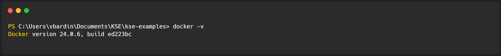
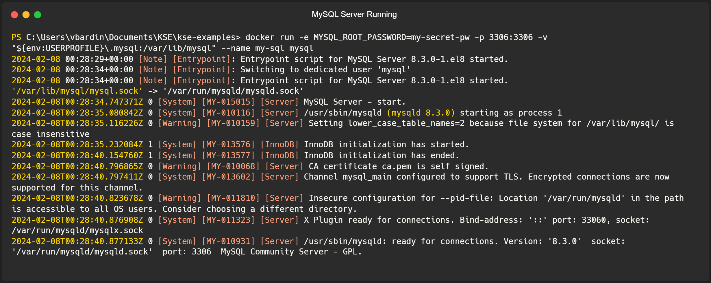
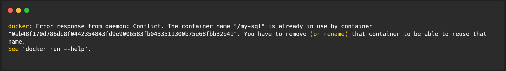
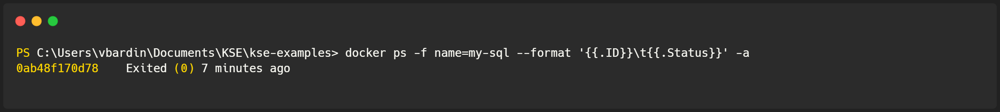
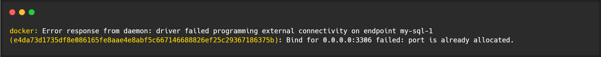
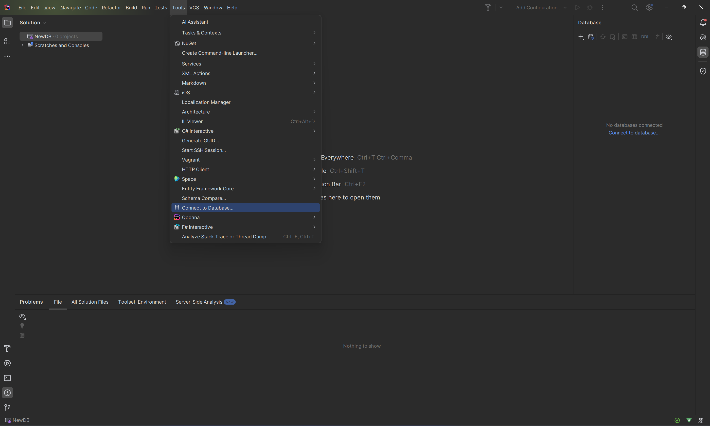
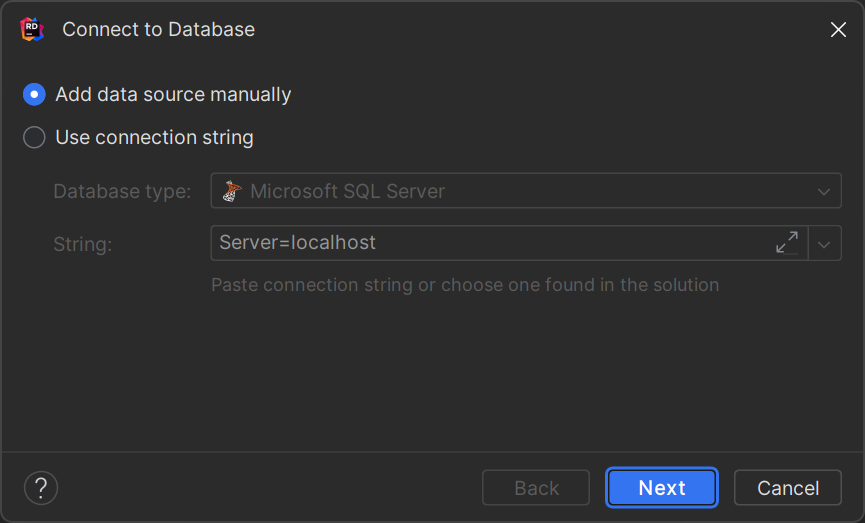
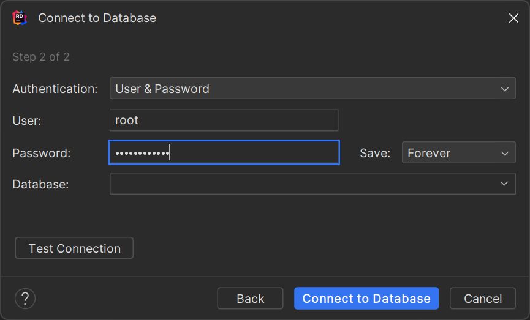
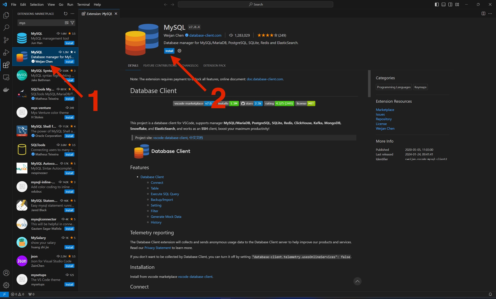
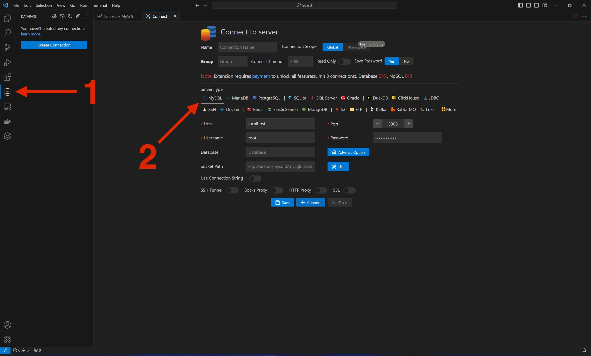

# Run a local instance of MySQL Server using Docker

## Quickstart

1. Ensure Docker Desktop is running.
   To ensure the Docker is running, run the following command at the terminal. If you see Docker's version - it is running. Otherwise, open the `Docker Desktop` application, and wait until it gets started.
   > $ docker ps

   Expected output:  
   

2. Try to run `MySQL` server
   To run `The MySQL server, run the next command in the terminal

`$ docker run -e MYSQL_ROOT_PASSWORD=my-secret-pw -p 3306:3306 -v "${env:USERPROFILE}\.mysql:/var/lib/mysql" --name my-sql mysql`.

> [!IMPORTANT]
> This command is a Windows-based command.
> You must create the directory `.mysql` on Windows at the `%USERPROFILE%`. To open the `%USERPROFILE%` directory, press Win+R and paste `%USERPROFILE%` to the opened window. Then press `OK`
>
> To run it on a Unix-like system, create the `.mysql` directory and set the path instead of `${env:USERPROFILE}\.mysql`. 

3. If an instance of MySQL started correctly in the terminal, you have to see the following output:
   

4. Open Rider or any other UI tool and connect to the database with the following credentials:

   | User     | Password     |
   |----------|--------------|
   | root     | my-secret-pw |

  

      <h2>Errors Handling</h2>
  

   ### Conflict. The container name "/my-sql" is already in use
   
   
   This error means that you already have a container with the same name. First of all, you have to check the status
   of this container. If it's running - you can use the existing one. Go to step 4 from the quickstart guide.
   
   To check the container's status, run the `docker ps -f name=my-sql --format '{{.ID}}' -a` command.
   
   
   If you see that the status is not `Running,` copy the container ID and remove it with the command `docker rm -f <CONTAINER_ID>`.
   
   
   Now, try to retry the Quickstart guide.
   
   ### Bind for 0.0.0.0:3306 failed: port is already allocated
   
   
   To fix this issue, you must modify the running command to replace `3306:3306` with `3307:3306` and rerun the command.
   Then,, when you try to connect to the database from Rider (or any other UI tool), instead of port `3306`,, use `3307`.

## Connect local-based MySQL DB to JetBrains Rider
### Start

- Open your JetBrains Rider and create a New Project
- Open `Tools` menu, and select `Connect to Database` option   
  
- Select `Add data source manually`
- Press the `Next` button   
  

### First Step
- In `Host` field put `localhost`
- Then put port, selected when you created server (by default `3306`) in the related field and press the `Next` button   
  
### Second Step
- Authentication: select `User & Password`
- User: put user name, selected when you created server (by default `root`)
- Password: put here your very secret password
- Save: responsible for what time Rider will remember your authentication credentials
- Database: if you already have one, you can choose it here (if you don't, you will create one soon)
- Press the `Connect to Database` button   
  
  
Congratulations! You just connected Rider with MySQL!

## Connect local-based MySQL DB to Visual Studio Code
### Start
- Navigate to `Extensions` menu
- In search field type `MySQL`
  
### Installing MySQL extension
1. Choose the second one in the list
2. Press `Install` button   
   

### Connecting to MySQL database
1. On the left side choose the newly appeared `Database` menu, then press `Create connection`
2. Choose `MySQL` tab   
   
3. Fill gaps in the fields as shown below 
- Host: `localhost`
- Port: put port, selected when you created the server (by default `3306`)
- Username: your user name, selected when you created the server (by default `root`)
- Password: put here your very secret password
- Database: if you haven't one on the server, just leave it blank
- Press `Connect` button
  
Congratulations! You just connected Visual Studio Code with MySQL!
