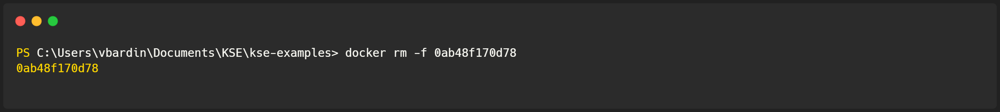

# Setup a local instance of MySQL Server

  

      <h2>Installing on your system</h2>
  

  **1. Download MySQL Server:**

   Visit the official MySQL website [here](https://dev.mysql.com/downloads/mysql/) and select the appropriate version of the **MySQL Community Server** for your operating system (Windows, macOS, Linux). For Windows 10, we'll use the .msi installer as an example.

**2. Install MySQL Server:**

   - Run the downloaded file to begin the MySQL Server setup process.
   - Follow the on-screen instructions provided for your operating system. For most cases, sticking with the default settings is recommended. However, pay attention to the following key steps:

     - Choose the "Typical Setup Type" option.

       

     - Once the installation wizard is complete, ensure the "Run MySQL Configurator" option at the bottom is selected. (You can run MySQL Configurator from the Start Menu either)

       

     - Now, you are creating a certain server. As it was said, keeping everything default is fine. Here you can change the Port of your server (3306 - default)

       

     - Enter the password for the root account. Please !**remember**! to store this password in a secure place.

       

     - Follow these options (they are default as well):

       

       

       

     - Execute the configuration, wait for completion, and you're done!
     - Connect your MySQL server to your database in Rider or your preferred IDE.

  

      <h2>Docker</h2>
  

   1. Ensure Docker Desktop is running.
      To ensure the Docker is running, run the following command at the terminal. If you see Docker's version - it is running. Otherwise, open the `Docker Desktop` application, and wait until it gets started.
      > $ docker ps
   
      Expected output:  
      
   
   2. Try to run `MySQL` server
      To run `The MySQL server, run the following command in the terminal.
   
   `$ docker run -e MYSQL_ROOT_PASSWORD=my-secret-pw -p 3306:3306 -v "${env:USERPROFILE}\.mysql:/var/lib/mysql" --name my-sql mysql`.
   
   > [!IMPORTANT]
   > This command is a Windows-based command.
   > You must create the directory `.mysql` on Windows at the `%USERPROFILE%`. To open the `%USERPROFILE%` directory, press Win+R and paste `%USERPROFILE%` to the opened window. Then press `OK`
   >
   > To run it on a Unix-like system, create the `.mysql` directory and set the path instead of `${env:USERPROFILE}\.mysql`. 
   
   3. If an instance of MySQL started correctly in the terminal, you have to see the following output:
      
   
   4. Open Rider or any other UI tool and connect to the database with the following credentials:
   
      | User     | Password     |
      |----------|--------------|
      | root     | my-secret-pw |

  

      <h2>Errors Handling</h2>
  

   ### Conflict. The container name "/my-sql" is already in use
   
   
   This error means that you already have a container with the same name. First of all, you have to check the status
   of this container. If it's running - you can use the existing one. Go to step 4 from the quickstart guide.
   
   To check the container's status, run the `docker ps -f name=my-sql --format '{{.ID}}' -a` command.
   
   
   If the status is not `Running,` copy the container ID and remove it with the command `docker rm -f <CONTAINER_ID>`.
   
   
   Now, try to retry the Quickstart guide.
   
   ### Bind for 0.0.0.0:3306 failed: port is already allocated
   
   
   To fix this issue, you must modify the running command to replace `3306:3306` with `3307:3306` and rerun the command.
   Then, when you try to connect to the database from Rider (or any other UI tool), instead of port `3306`, use `3307`.

  

      <h2>Connect to local-based MySQL DB to JetBrains Rider</h2>
  

   ### Start

- Open your JetBrains Rider and create a New Project
- Open the `Tools` menu, and select the `Connect to Database` option   
  
- Select `Add data source manually`
- Press the `Next` button   
  

### First Step
- In the `Host` field, put `localhost`
- Then put the port, selected when you created the server (by default `3306`) in the related field and press the `Next` button   
  
### Second Step
- Authentication: select `User & Password`
- User: put the user name, selected when you created the server (by default, `root`)
- Password: put here your very secret password
- Save: responsible for what time Rider will remember your authentication credentials
- Database: if you already have one, you can choose it here (if you don't, you will create one soon)
- Press the `Connect to Database` button   
  
  
Congratulations! You just connected Rider with MySQL!

  

      <h2>Connect to local-based MySQL DB to Visual Studio Code</h2>
  

   ### Start
   - Navigate to the `Extensions` menu
   - In the search field, type `MySQL`
     
   ### Installing MySQL extension
   1. Choose the second one in the list
   2. Press the `Install` button   
      
   
   ### Connecting to MySQL database
   1. On the left side, choose the newly appeared `Database` menu, then press `Create connection`
   2. Choose `MySQL` tab   
      
   3. Fill gaps in the fields as shown below 
   - Host: `localhost`
   - Port: put the port, selected when you created the server (by default, `3306`)
   - Username: your user name, selected when you created the server (by default `root`)
   - Password: put here your very secret password
   - Database: if you haven't one on the server, leave it blank
   - Press the `Connect` button
     
   Congratulations! You just connected Visual Studio Code with MySQL!

---

Contributors:
- [Vladyslav Bardin](https://github.com/Bardin08)
- [Mark Tabatskyi](https://github.com/Tabatskyi)
