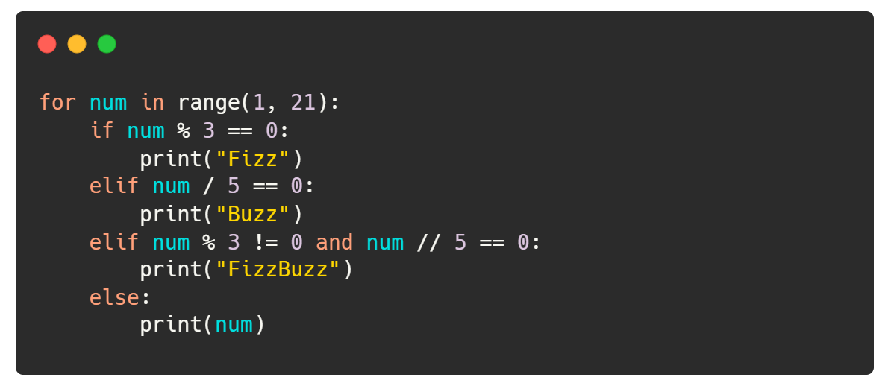
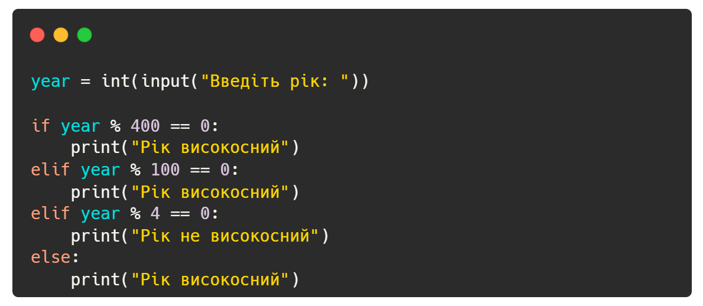

# Questions

## Theoretical questions

### **Базові типи даних:**

- Що таке змінна в Python?
- Які основні числові типи даних у Python?
- Як в Python перетворити строку в число?
- Що таке булеві значення в Python?
- Які операції можна виконувати з рядками в Python?
- Які типи даних в Python є незмінюваними?
- Що таке тип даних None в Python?
- Які операції можливі з числовими типами даних в Python?
- Як в Python здійснюється конкатенація рядків?
- Як у Python перевірити тип даних змінної?
- Які логічні оператори доступні в Python?
- Як в Python виконати приведення типів?
- Як отримати довжину рядка в Python?
- Як в Python визначити, що змінна є числом?
- Які способи форматування рядків існують в Python?
- Як у Python перевірити рівність рядків?
- Як у Python використовувати оператори порівняння?
- Які правила іменування змінних в Python?
- Що таке інтерполяція рядків в Python?
- Як в Python здійснюється копіювання рядків?

### **Колекції:**

- Що таке список у Python і як він створюється?
- Як додати елемент до кінця списку в Python?
- Що таке кортеж у Python і в чому його відмінність від списку?
- Як перевірити наявність елемента в словнику Python?
- Як видалити елемент з множини в Python?
- Як створити словник у Python?
- Які методи можна використовувати для роботи зі списками в Python?
- Як змінити елемент у списку Python?
- Що таке розпаковка колекцій в Python?
- Як об'єднати два словника в Python?
- Як в Python знайти довжину списку?
- Як в Python видалити елемент зі списку за індексом?
- Які особливості роботи з множинами в Python?
- Як в Python звернутися до елемента словника?
- Як в Python створити пусту множину?
- Які методи доступні для роботи з кортежами в Python?
- Як в Python видалити всі елементи зі списку?
- Як в Python перевірити, чи є ключ у словнику?
- Як у Python отримати список ключів зі словника?
- Як в Python знайти перетин двох множин?
- Як в Python отримати підмножину списку?
- Як в Python перевірити наявність елемента в списку?
- Які особливості використання індексів у списках Python?
- Як в Python використовувати метод get для словників?
- Як в Python видалити елемент зі словника за ключем?

## Part Two: Fix the code

### FizzBuzz

Завдання полягає в ідентифікації та виправленні помилок у наданому коді програми FizzBuzz. Програма має ітерувати числа
від 1 до заданого числа n і виводити для кожного числа:

- "Fizz", якщо число кратне 3;
- "Buzz", якщо число кратне 5;
- "FizzBuzz", якщо число кратне і 3, і 5 одночасно;
- Саме число, якщо воно не кратне ні 3, ні 5.
  Код:
  

### LeapYear

Ваше завдання полягає в ідентифікації та виправленні помилок у наданому коді програми LeapYear. Програма має отримати на
вхід рік, і сказати, чи є він високосним.
Правила для визначення високосного року:

- Рік є високосним, якщо він кратний 4.
- Однак, якщо рік кратний 100, він високосним не є.
- При цьому, якщо рік кратний 400, він все ж таки високосний.

Код:

## Part three : Sapper Game

_**Основні характеристики гри**_:

- Розмір поля: Поле для гри має розмір 4х4, що складається з клітинок.
- Обрання кількості мін: Користувач обирає кількість мін, які будуть розташовані на полі. Відповідно до обраної кількості
мін, користувач отримує певну кількість життів: 1 міна - 1 життя, 2-4 міни - 2 життя, 5-6 мін - 3 життя.
- Гра на вгадування: Користувач обирає клітинку на полі. Якщо вибрана клітинка містить міну, користувач втрачає одне
життя, а вміст цієї клітинки замінюється на "Х". Якщо міни немає, вміст клітинки замінюється на "0".
- Умова перемоги і програшу: Користувач виграє, якщо він відкрив усі клітинки, де немає мін. Програш настає, якщо у
користувача закінчилися всі життя.
